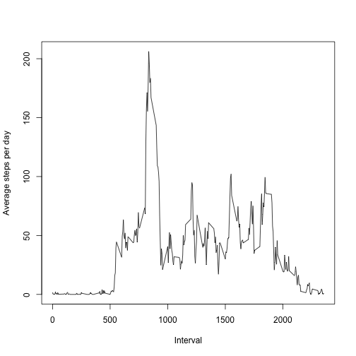

# Activity Log Analysis

## Introduction

It is now possible to collect a large amount of data about personal movement using activity monitoring devices such as a [Fitbit](http://www.fitbit.com/), [Nike Fuelband](http://www.nike.com/us/en_us/c/nikeplus-fuelband), or [Jawbone Up](https://jawbone.com/up). These type of devices are part of the "quantified self" movement -- a group of enthusiasts who take measurements about themselves regularly to improve their health, to find patterns in their behavior, or because they are tech geeks. But these data remain under-utilized both because the raw data are hard to obtain and there is a lack of statistical methods and software for processing and interpreting the data.

This assignment makes use of data from a personal activity monitoring device. This device collects data at 5 minute intervals through out the day. The data consists of two months of data from an anonymous individual collected during the months of October and November, 2012 and include the number of steps taken in 5 minute intervals each day.

## Loading and preprocessing the data

Loading the data:


```r
library(dplyr)
setwd('/Users/renato/Documents/Coursera/Coursera-Data-Science/Reproducible Research/')
activity <- read.csv('activity.csv')
str(activity)
```

```
## 'data.frame':	17568 obs. of  3 variables:
##  $ steps   : int  NA NA NA NA NA NA NA NA NA NA ...
##  $ date    : Factor w/ 61 levels "2012-10-01","2012-10-02",..: 1 1 1 1 1 1 1 1 1 1 ...
##  $ interval: int  0 5 10 15 20 25 30 35 40 45 ...
```

```r
head(activity)
```

```
##   steps       date interval
## 1    NA 2012-10-01        0
## 2    NA 2012-10-01        5
## 3    NA 2012-10-01       10
## 4    NA 2012-10-01       15
## 5    NA 2012-10-01       20
## 6    NA 2012-10-01       25
```

## What is mean total number of steps taken per day?

The total number of steps taken per day:


```r
df <- tbl_df(activity)
total_steps_per_day <- df %>% group_by(date) %>% 
        summarize(total_steps = sum(steps))
total_steps_per_day
```

```
## # A tibble: 61 x 2
##          date total_steps
##        <fctr>       <int>
##  1 2012-10-01          NA
##  2 2012-10-02         126
##  3 2012-10-03       11352
##  4 2012-10-04       12116
##  5 2012-10-05       13294
##  6 2012-10-06       15420
##  7 2012-10-07       11015
##  8 2012-10-08          NA
##  9 2012-10-09       12811
## 10 2012-10-10        9900
## # ... with 51 more rows
```

Code below shows a histogram of the total number of steps taken each day:


```r
hist(total_steps_per_day$total_steps, 
     main = 'Histogram of Total Number of Steps per Day',
     xlab = 'Total number of steps taken each day')
```


The mean and median of the total number of steps taken per day:


```r
mean(total_steps_per_day$total_steps, na.rm = TRUE)
```

```
## [1] 10766.19
```

```r
median(total_steps_per_day$total_steps, na.rm = TRUE)
```

```
## [1] 10765
```


## What is the average daily activity pattern?

A time series plot (i.e. type = "l") of the 5-minute interval (x-axis) and the average number of steps taken, averaged across all days (y-axis), is shown below:


```r
avg <- df %>% group_by(interval) %>%
        summarize(avg_steps = mean(steps, na.rm = TRUE))
plot(x = avg$interval, y = avg$avg_steps, xlab = 'Interval', ylab = 'Average steps per day', type = 'l')
```



The 5-minute interval, on average across all the days in the dataset, that contains the maximum number of steps is:


```r
avg[avg$avg_steps == max(avg$avg_steps), ]
```

```
## # A tibble: 1 x 2
##   interval avg_steps
##      <int>     <dbl>
## 1      835  206.1698
```


## Imputing missing values

The total number of missing values in the dataset is:


```r
sum(is.na(activity))
```

```
## [1] 2304
```

Missing values were then filled with the mean for that 5-minute interval:


```r
df_no_na <- merge(activity, avg, by = 'interval')
df_no_na <- df_no_na[order(df_no_na$date), ] # put it back on the original order
df_no_na$steps[is.na(df_no_na$steps)] <- df_no_na$avg_steps[is.na(df_no_na$steps)] # fill in the NAs
df_no_na <- df_no_na %>% select(steps, date, interval)
```

The new dataset has no NAs, as shown below:


```r
sum(is.na(df_no_na))
```

```
## [1] 0
```

A new histogram of the total number of steps taken each day was plotted.


```r
# calculate the total steps in the new dataset
df_no_na <- tbl_df(df_no_na)
total_steps_per_day_no_na <- df_no_na %>% group_by(date) %>% 
        summarize(total_steps = sum(steps))

hist(total_steps_per_day_no_na$total_steps, 
     main = 'Histogram of Total Number of Steps per Day',
     xlab = 'Total number of steps taken each day')
```


When compared to the dataset with NAs, there is not much visible differences.

The same goes for the mean and median:

```r
mean(total_steps_per_day_no_na$total_steps)
```

```
## [1] 10766.19
```

```r
median(total_steps_per_day_no_na$total_steps)
```

```
## [1] 10766.19
```


## Are there differences in activity patterns between weekdays and weekends?

First of all, a new factor variable was added to the dataset:


```r
weekday_vector <- c('Monday', 'Tuesday', 'Wednesday', 'Thursday', 'Friday')
df_weekdays <- df_no_na %>% mutate(weekday_name = weekdays(as.POSIXct(date)))
df_weekdays <- df_weekdays %>% 
        mutate(day_of_week = ifelse(weekday_name %in% weekday_vector, 
                                    'weekday', 'weekend')) %>%
        select(-weekday_name)
head(df_weekdays)
```

```
## # A tibble: 6 x 4
##       steps       date interval day_of_week
##       <dbl>     <fctr>    <int>       <chr>
## 1 1.7169811 2012-10-01        0     weekday
## 2 0.3396226 2012-10-01        5     weekday
## 3 0.1320755 2012-10-01       10     weekday
## 4 0.1509434 2012-10-01       15     weekday
## 5 0.0754717 2012-10-01       20     weekday
## 6 2.0943396 2012-10-01       25     weekday
```

A panel plot containing a time series plot (i.e. type = "l") of the 5-minute interval (x-axis) and the average number of steps taken, averaged across all weekday days or weekend days (y-axis), is shown below


```r
par(mfrow = c(2, 1))
plot(x = df_weekdays$interval[df_weekdays$day_of_week == 'weekday'],
     y = df_weekdays$steps[df_weekdays$day_of_week == 'weekday'],
     main = 'Num. of steps avg. in weekday',
     xlab = 'Interval', ylab = 'Num. Steps', type = 'l')
plot(x = df_weekdays$interval[df_weekdays$day_of_week == 'weekend'], 
     y = df_weekdays$steps[df_weekdays$day_of_week == 'weekend'],
     main = 'Num. of steps avg. in weekend',
     xlab = 'Interval', ylab = 'Num. Steps', type = 'l')
```


We can notice a few difference in activity in weekdays and weekend. On weekend the number of steps are reduced and the activities starts a bit late in the day.
